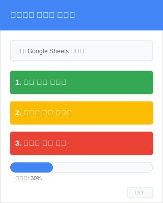
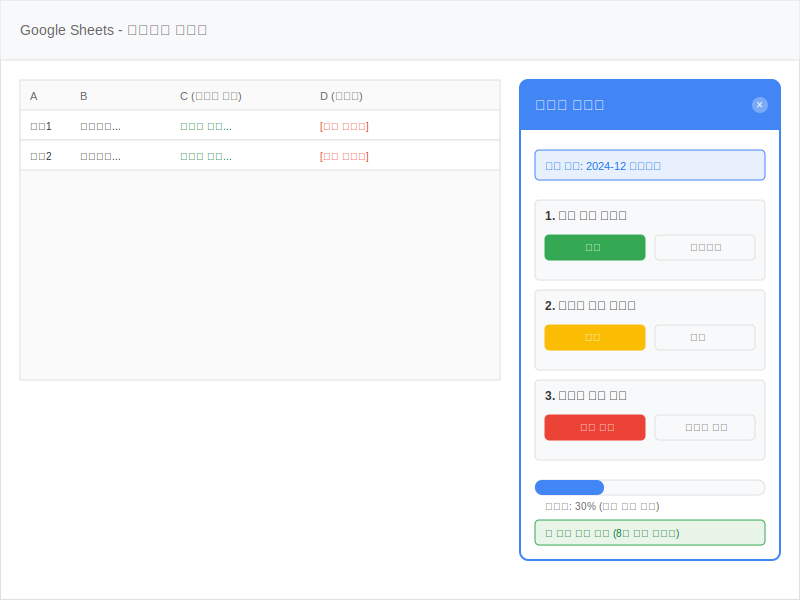
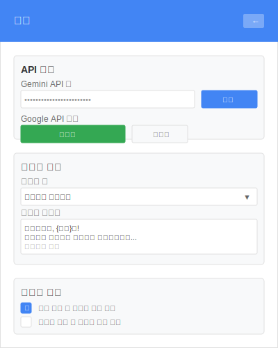

# UX 와이어프레임

## 1. Extension Popup Interface

Chrome 브라우저 상단의 Extension 아이콘 클릭 시 나타나는 메인 팝업 인터페이스입니다.

### 주요 기능

- **상단 헤더**: 확장 프로그램 제목 표시
- **연결 상태**: Google Sheets 연결 상태 확인
- **3단계 자동화 버튼**:
  - 1단계: 답변 정리 자동화 (녹색)
  - 2단계: 피드백 생성 자동화 (주황색)
  - 3단계: 이메일 발송 준비 (빨간색)
- **진행률 표시**: 현재 작업 진행 상황 시각화
- **설정 버튼**: 확장 프로그램 설정 페이지 이동

## 2. Content Script Interface (Google Sheets 페이지 내)

Google Sheets 리포트 시트 페이지에서 활성화되는 플로팅 패널 인터페이스입니다.

### 주요 기능

- **플로팅 패널**: Google Sheets 페이지 우측에 표시되는 Extension 인터페이스
- **현재 시트 정보**: 작업 중인 리포트 시트명 표시
- **3단계 작업 섹션**:
  - 각 단계별 실행/미리보기 버튼
  - 작업 상태 및 결과 표시
- **실시간 진행률**: 전체 자동화 프로세스 진행 상황
- **상태 메시지**: 완료된 작업 및 처리 결과 표시
- **Google Sheets 연동**: 실시간으로 시트 데이터 업데이트 반영

### 인터페이스 상호작용

- **실행 버튼**: 각 단계별 AI 자동화 실행
- **미리보기/검토 버튼**: 생성된 결과 사전 확인
- **닫기 버튼**: 패널 숨김/표시 토글

## 3. Settings Interface

Extension 설정 및 개인화 옵션을 관리하는 인터페이스입니다.

### 주요 기능

- **API 설정 섹션**:
  - Gemini API 키 관리
  - Google API 인증 상태 확인 및 재인증
- **개인화 설정 섹션**:
  - 피드백 톤 선택 (친근함, 전문적, 격려적 등)
  - 이메일 템플릿 편집
- **자동화 옵션 섹션**:
  - 단계별 자동 실행 설정
  - 워크플로우 커스터마이징

### 설정 옵션

- **피드백 톤**: 드롭다운으로 말투 스타일 선택
- **이메일 템플릿**: 개인화된 이메일 메시지 템플릿 편집
- **자동화 체인**: 각 단계 완료 후 다음 단계 자동 실행 여부
